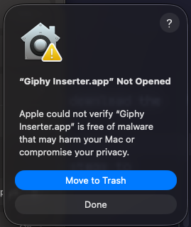
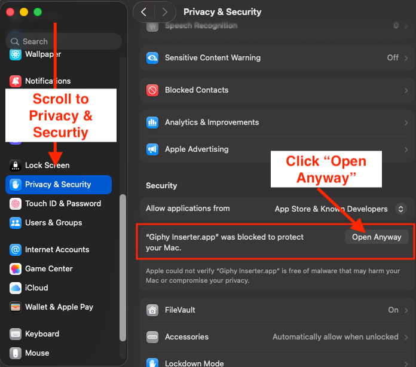
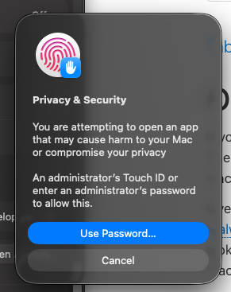
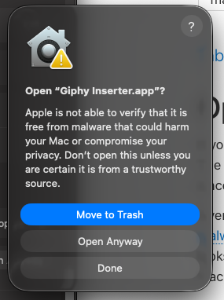

# ✨ Giphy Inserter

[](https://github.com/ashajjar/giphy-inserter-private/actions/workflows/build.yml)
[](https://github.com/ashajjar/giphy-inserter-private/releases/latest)

A sleek, lightweight desktop application built with **Compose for Desktop** that helps you quickly find and copy Giphy animations to your clipboard.


## 🚀 Features

- **Quick Search**: Effortlessly search for GIFs using the Giphy API.
- **Random Discovery**: Discover new GIFs with a single shortcut.
- **Copy to Clipboard**: Instant copy functionality to use GIFs anywhere.
- **Keyboard Shortcuts**: Designed for power users who love speed.
- **Minimalist UI**: A clean, transparent, and undecorated interface that stays out of your way.
- **System Tray Integration**: Keep it running in the background and access it quickly when needed.

## ⌨️ Shortcuts

- `Enter` / `Down Arrow`: Fetch next GIF for the current search.
- `Up Arrow`: Fetch previous GIF.
- `Cmd + C` (macOS): Copy current GIF to clipboard (as GIF file, URL, and HTML).
- `Cmd + R` (macOS): Fetch a random GIF.
- `Cmd + ,` (macOS): Open Settings.
- `Esc`: Exit application.

*Note: For Windows/Linux, use `Ctrl` instead of `Cmd`.*

## 📦 Installation

You can either check out the source code and build the app yourself or download the latest release from the [release page](https://github.com/ashajjar/giphy-inserter-private/releases/latest).

If you choose to download the latest release, you have to follow these steps to install it and be able to use it:

1. Download the latest version from the [releases page](https://github.com/ashajjar/giphy-inserter-private/releases/latest).
2. Open the `.dmg` file and drag **Giphy Inserter** to your **Applications** folder.

#### Bypassing macOS Gatekeeper
Since this application is not signed by a recognized developer, macOS might block it from opening. Follow these steps to allow it:

1. **Attempt to Open**: Try to open the app. If a warning appears, click **Done**.

   

2. **Open System Settings**: Go to the Apple menu  > **System Settings**.
3. **Privacy & Security**: Navigate to **Privacy & Security** in the sidebar.
4. **Security Section**: Scroll down to the **Security** section. You will see a message saying `"Giphy Inserter.app" was blocked`.
5. **Open Anyway**: Click the **Open Anyway** button.
   
6. **Authenticate**: Enter your administrator password or use Touch ID to confirm.
   
   

7. **Confirm**: A final dialog will appear. Click **Open Anyway**.

   

For more information, see [Apple's official guide on opening apps from unknown developers](https://support.apple.com/guide/mac-help/open-a-mac-app-from-an-unknown-developer-mh40616/mac).

## ⚙️ Configuration

To use the application, you need a Giphy API Key:
1. Get your free API key from the [Giphy Developers Portal](https://developers.giphy.com/).
2. Open the application.
3. Open **Settings** (`Cmd + ,`).
4. Enter your API Key and click **Save**.

## 🛠 Development

### Prerequisites
- JDK 11 or higher (JDK 15 or higher is required for building native distributions).

### Running the App
```bash
./gradlew run
```

### Building Native Distributions
You can build native distributions for your operating system:
- **macOS**: `./gradlew packageDmg`
- **Windows**: `./gradlew packageMsi`
- **Linux**: `./gradlew packageDeb`

---
*Built with ❤️ using Compose for Desktop.*
